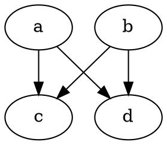
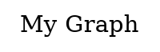
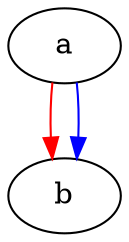

# DOT Language Specification

This document specifies the DOT graph description language as accepted by
the Graphviz **cgraph** parser. It is intended as a reference for
implementing and testing an alternative parser that produces equivalent
results. Tokenization rules are summarized in §1 (Lexical Overview); full
identifier and string-type rules are in §9 (Identifiers and String Types);
this document focuses on grammar, semantics, and observable behavior.

No implementation details (data structures, memory management, API calls)
are described. Only externally observable behavior matters for conformance.

**Document conventions:** Sections §1–§17 describe Graphviz DOT language
behavior — the main focus of this document. Where dotviz deliberately
diverges from the reference `dot` binary, the difference is highlighted
with a `> **dotviz:**` callout directly below the relevant description.
§18 consolidates all such intentional behavioral differences in one place
for easy reference.

---

## Table of Contents

1.  [Lexical Overview](#1-lexical-overview)
2.  [Grammar](#2-grammar)
3.  [Graph Declaration](#3-graph-declaration)
4.  [Statements](#4-statements)
5.  [Node Statements](#5-node-statements)
6.  [Edge Statements](#6-edge-statements)
7.  [Attribute Statements](#7-attribute-statements)
8.  [Subgraphs](#8-subgraphs)
9.  [Identifiers and String Types](#9-identifiers-and-string-types)
10. [Attribute Lists](#10-attribute-lists)
11. [The `key` Pseudo-Attribute](#11-the-key-pseudo-attribute)
12. [Port Syntax](#12-port-syntax)
13. [Strict Graphs](#13-strict-graphs)
14. [Comments and Whitespace](#14-comments-and-whitespace)
15. [Empty and Erroneous Input](#15-empty-and-erroneous-input)
16. [Edge Cases and Testing Notes](#16-edge-cases-and-testing-notes)
17. [Character Encodings](#17-character-encodings)
18. [dotviz Behavioral Differences from Graphviz](#18-dotviz-behavioral-differences-from-graphviz)

---

## 1. Lexical Overview

Tokenization is summarized here; full identifier and string rules are in
§9. This section covers the token types that the grammar operates on.

### 1.1 Token Types

| Token                                 | Examples / Description                                     |
| ------------------------------------- | ---------------------------------------------------------- |
| `T_strict`                            | Keyword `strict` (case-insensitive)                        |
| `T_graph`                             | Keyword `graph` (case-insensitive)                         |
| `T_digraph`                           | Keyword `digraph` (case-insensitive)                       |
| `T_node`                              | Keyword `node` (case-insensitive)                          |
| `T_edge`                              | Keyword `edge` (case-insensitive)                          |
| `T_subgraph`                          | Keyword `subgraph` (case-insensitive)                      |
| `T_edgeop`                            | `->` in directed graphs, `--` in undirected graphs         |
| `T_atom`                              | Unquoted name or number (carries string value)             |
| `T_qatom`                             | Double-quoted string or HTML string (carries string value) |
| `'{' '}' '[' ']' ';' ',' '=' ':' '+'` | Single-character punctuation                               |
| `EOF`                                 | End-of-input marker                                        |

### 1.2 Keywords Are Case-Insensitive

The keywords `node`, `edge`, `graph`, `digraph`, `strict`, and
`subgraph` are matched **case-insensitively**. For example, `Node`,
`NODE`, `GRAPH`, `Digraph`, `STRICT`, and `SubGraph` are all recognized
as their respective keywords. By convention, lowercase is preferred.

### 1.3 Identifiers

An **identifier** (called `atom` in the grammar) can be any of:

- An unquoted name: starts with a letter (A–Z, a–z), underscore, or any
  byte in 0x80–0xFF, followed by zero or more letters, digits, underscores,
  or bytes in 0x80–0xFF.
- A number: optional leading `-`, followed by digits with an optional
  decimal point (e.g., `42`, `3.14`, `.5`, `-0.7`, `100.`).
- A double-quoted string: `"..."` with escape rules (see §9).
- An HTML string: `<...>` with angle-bracket nesting (see §9).

All four forms are **interchangeable** everywhere the grammar expects an
identifier. A node can be named `foo`, `"foo"`, or `<foo>`, and all three
are syntactically valid.

> **Note:** To use a keyword (`node`, `edge`, `graph`, `digraph`,
> `strict`, `subgraph`) as an identifier (e.g., as a node name), it
> must be quoted: `"node"` is a valid node name, but unquoted `node`
> is always parsed as a keyword.

### 1.4 Edge Operator

The edge operator depends on graph type:

- **Directed graph** (`digraph`): the edge operator is `->`.
- **Undirected graph** (`graph`): the edge operator is `--`.

Using the wrong operator for the graph type is a **syntax error**.
(The lexer consumes both characters but does not produce an edge operator
token; the parser sees an unexpected token.)

---

## 2. Grammar

The grammar below is expressed in BNF-like notation. Terminals are shown
in **`monospace bold`** or as quoted characters. Non-terminals are in
_italics_. `ε` denotes the empty production. `|` separates alternatives.

```bnf
graph        → hdr body
             | ε

hdr          → optstrict graphtype optgraphname

body         → '{' optstmtlist '}'

optstrict    → 'strict'
             | ε

graphtype    → 'graph'
             | 'digraph'

optgraphname → atom
             | ε

optstmtlist  → stmtlist
             | ε

stmtlist     → stmtlist stmt
             | stmt

stmt         → attrstmt optsemi
             | compound optsemi

optsemi      → ';'
             | ε

compound     → simple rcompound optattr

simple       → nodelist
             | subgraph

rcompound    → T_edgeop simple rcompound
             | ε

nodelist     → node
             | nodelist ',' node

node         → atom
             | atom ':' atom
             | atom ':' atom ':' atom

attrstmt     → attrtype optmacroname attrlist
             | graphattrdefs

attrtype     → 'graph'
             | 'node'
             | 'edge'

optmacroname → atom '='
             | ε

graphattrdefs→ attrassignment

optattr      → attrlist
             | ε

attrlist     → optattr '[' optattrdefs ']'

optattrdefs  → optattrdefs attrdefs
             | ε

attrdefs     → attrassignment optseparator

attrassignment → atom '=' atom

optseparator → ';'
             | ','
             | ε

subgraph     → optsubghdr body

optsubghdr   → 'subgraph' atom
             | 'subgraph'
             | ε

atom         → T_atom
             | qatom

qatom        → T_qatom
             | qatom '+' T_qatom
```

### 2.1 Key Grammar Properties

- **One graph per input.** The parser consumes exactly one `graph`
  production, then expects end-of-input.
- **Statements are not separated by newlines.** Newlines are whitespace.
  The optional `;` separator is purely stylistic.
- **The grammar is LALR(1)-parseable.** A single token of lookahead
  suffices for all disambiguation.

---

## 3. Graph Declaration

A DOT graph begins with an optional `strict` keyword, followed by `graph`
or `digraph`, an optional name, and a body enclosed in braces.

### 3.1 Syntax

```dot
[strict] graph  [name] { ... }
[strict] digraph [name] { ... }
```

### 3.2 Graph Type

- `graph` declares an **undirected** graph. Edges use `--`.
- `digraph` declares a **directed** graph. Edges use `->`.

The graph type is **fixed for the entire input** by whichever keyword
appears first. If `graph` or `digraph` keywords appear later (e.g.,
as `attrtype` in attribute statements), they do not change the graph type.

### 3.3 The `strict` Keyword

When `strict` is specified, the graph allows **at most one edge** between
any ordered pair of nodes (directed) or any unordered pair (undirected).
Duplicate edge statements are silently collapsed — the existing edge is
returned and any new attributes are applied to it. Self-loops are
permitted and follow the same duplicate-edge rules (see §13.4).

### 3.4 Graph Name

The graph name is an optional identifier. If omitted, the graph is
unnamed. The name can be an unquoted name, a number, a quoted
string, or an HTML string.

**Note on `agconcat` and Graph Headers:** When using the C API function
`agconcat()` to parse DOT source into an _existing_ graph object, the
entire graph header in the source (`strict`, `graph`/`digraph`, and the
name) is syntactically parsed but **silently ignored**. The parsed
contents are simply merged into the existing graph, which retains its
original name, directedness, and strictness.

### 3.5 Examples

```dot
graph { }
digraph G { }
strict graph "My Graph" { }
strict digraph { }
```

---

## 4. Statements

The body of a graph (or subgraph) contains zero or more statements.
Each statement is optionally followed by a semicolon `;`.

There are three kinds of statements:

1. **Node statements** — declare nodes and optionally set their attributes.
2. **Edge statements** — declare edges and optionally set their attributes.
3. **Attribute statements** — set default attributes for a class of objects
   (graph, node, or edge), or set graph-level attributes directly.

The distinction between a node statement and an edge statement is
determined by whether an edge operator follows the initial node
reference(s): the same syntax becomes a node statement when no edge
operator follows, and an edge statement when one does.

---

## 5. Node Statements

### 5.1 Syntax

```dot
nodelist [attrlist]
```

Where `nodelist` is one or more node references separated by commas.

A node reference is:

```dot
nodename
nodename : portname
nodename : portname : compass
```

### 5.2 Semantics

- Each node named in the list is **created** if it does not already exist
  in the current (sub)graph.
- If an attribute list follows, those attributes are applied to **every
  node** in the list.
- Port specifiers in a node-only statement (without edge operators) are
  parsed but have **no observable effect**. Ports only matter in edge
  contexts (see §12).

  > **dotviz:** A port specifier in a node-only statement is rejected
  > with a fatal error (see §18.2).

### 5.3 Examples

```dot
a;
a, b, c;
a [color=red];
a, b [shape=box, label="hello"];
"node 1" [label="First"];
```

### 5.4 Edge Cases

- A single identifier followed by an attribute list is a node statement:
  `a [x=y]` creates node `a` with attribute `x=y`.
- A comma-separated list without edge operators is always a node statement,
  even if the list contains only one element: `a,` is a syntax error (the
  grammar expects a node after `,`).
- Node names can be keywords if quoted: `"node"` is a valid node name.
  Unquoted `node` is a keyword and starts a default attribute statement, not a
  node statement.
- Multiple statements referencing the same node name refer to the same
  node. Attributes accumulate/override.

---

## 6. Edge Statements

### 6.1 Syntax

```dot
endpoint T_edgeop endpoint [T_edgeop endpoint ...] [attrlist]
```

Where each `endpoint` is either a `nodelist` (comma-separated node
references) or a `subgraph`.

### 6.2 Edge Operator

- `->` for directed graphs.
- `--` for undirected graphs.

Using `->` in a `graph` or `--` in a `digraph` is a syntax error.

### 6.3 Edge Chain Semantics

An edge chain with N endpoints (separated by N−1 edge operators) creates
edges between **consecutive pairs** of endpoints, not a full clique.

```dot
a -> b -> c -> d
```

Creates edges: `a→b`, `b→c`, `c→d`. Does **NOT** create `a→c`, `a→d`,
or `b→d`.

### 6.4 Cross-Product with Node Lists

When an endpoint is a comma-separated node list, edges are created as the
**Cartesian product** between consecutive endpoint groups.

```dot
a, b -> c, d
```

Creates four edges: `a→c`, `a→d`, `b→c`, `b→d`.

### 6.5 Cross-Product with Subgraphs

When a subgraph is used as an endpoint, edges are created from/to **every
node contained in that subgraph** (including nodes in nested subgraphs).



Creates four edges: `a→c`, `a→d`, `b→c`, `b→d`.

### 6.6 Mixed Chains

Chains can mix node lists and subgraphs:

```dot
a, b -> {c; d} -> e
```

Creates edges: `a→c`, `a→d`, `b→c`, `b→d`, `c→e`, `d→e`.

### 6.7 Attributes on Edge Statements

If an attribute list follows the edge chain, those attributes are applied
to **all edges** created by the entire chain.

```dot
a -> b -> c [color=red]
```

Both edge `a→b` and edge `b→c` receive `color=red`.

### 6.8 Node Creation

All nodes referenced in an edge statement are **created** if they do not
already exist, just as in node statements.

### 6.9 Port Handling in Edges

When a node reference in an edge statement includes port specifiers
(`nodename:portname` or `nodename:portname:compass`), the port is recorded on the
created edge as its tail or head port attribute.

When a subgraph is used as an edge endpoint, no port can be specified;
all edges to/from subgraph members have **no port**.

### 6.10 Edge Cases

- An edge chain must have at least two endpoints:
  `a ->` alone is a syntax error.
- Self-loops are allowed: `a -> a`.
- In strict graphs, self-loops follow normal duplicate-edge rules (see §13):
  the first self-loop is created; subsequent duplicates are collapsed.
- The same edge can be declared multiple times; attributes from later
  declarations override earlier ones for the same attribute names.
- In non-strict directed graphs, parallel edges (same source and
  destination) are distinct edges. Use the `key` pseudo-attribute to
  control edge identity (see §11).

---

## 7. Attribute Statements

### 7.1 Default Attribute Statements

```dot
graph [attr1=val1; attr2=val2]
node  [attr1=val1; attr2=val2]
edge  [attr1=val1; attr2=val2]
```

These set **default attribute values** for the specified object class
within the current (sub)graph scope.

- `graph [...]` — sets default graph/subgraph attributes.
- `node [...]` — sets default attributes for subsequently created nodes.
- `edge [...]` — sets default attributes for subsequently created edges.
- Default attributes apply **temporally**: only objects of the
  appropriate type defined **after** the default statement inherit the
  value. This holds until the default is set to a new value, from which
  point the new value is used.
- Objects defined **before** a default attribute is set will have an
  **empty string** value attached to the attribute once the default
  definition is made.
- A subgraph receives the attribute settings of its **parent graph at
  the time of its definition**. For example, assigning a font to the
  root graph causes all subsequently defined subgraphs to inherit that
  font.

Default attributes established in a subgraph apply within that subgraph
and its descendants, but do not affect the parent graph.

> **dotviz (verified against `dot -Tcanon`):** When a default attribute
> statement is processed, objects that **already exist** in scope receive
> an empty-string (`""`) back-fill for any key introduced by the statement
> (so the key appears in their attribute map, but any explicitly set value
> takes precedence). The value used as the back-fill seed for the _next_
> default-change for the same key is the **current** default at the time
> of that change — not `""`. This produces the apparent "last write wins"
> appearance at the root level. Behaviour has been verified with subgraphs
> created before, between, and after multiple default-change statements.

### 7.2 Bare Graph Attribute Assignment

A bare `name = value` statement (without a `graph` keyword prefix) at
the top level of any graph or subgraph body is a **graph attribute**
assignment:



This is equivalent to:


### 7.3 Keyword Disambiguation

Because `graph`, `node`, and `edge` are keywords:

- `graph [color=red]` is a **default attribute statement** (sets graph
  attribute defaults).
- `"graph" [color=red]` is a **node statement** (creates a node named
  `graph` with attribute `color=red`), because `"graph"` is a quoted
  string (`T_qatom`), not the keyword.
- `graph1 [color=red]` is a **node statement**, because `graph1` is an
  identifier (`T_atom`), not the keyword `graph`.

### 7.4 Macro Names (Deprecated)

The grammar supports the syntax `attrtype name = [attrs]` (e.g.,
`node mytemplate = [shape=box]`), where `name =` defines a "macro name."
This feature is **not implemented** in `dot` — the parser accepts the
syntax, emits `Warning: attribute macros not implemented`, applies the
attributes, and ignores the macro name.

> **dotviz:** Macro name syntax is rejected immediately with a fatal
> error. Because attribute macros are deprecated and not implemented even
> in `dot`, failing fast with a clear error is safer than silently
> discarding an unknown token.
>
> _Migration:_ if legacy macro-name files must be supported, detect an
> identifier followed by `=` immediately after the `node`/`edge`/`graph`
> keyword, consume both tokens with a warning, and proceed normally.

### 7.5 Edge Cases

- `graph []` is valid — an empty attribute list. No attributes change.
- Multiple attribute list brackets chain: `node [shape=box][color=red]`
  is equivalent to `node [shape=box, color=red]`.
- Attribute values are always strings. The parser does not interpret
  numeric values, booleans, or color names — all values are opaque
  strings. Type interpretation happens downstream.
- HTML strings as attribute values retain their HTML tagging:
  `label=<b>hello</b>` stores an HTML string, whereas
  `label="<b>hello</b>"` stores a plain string with the same character
  content. The distinction affects downstream rendering.

---

## 8. Subgraphs

### 8.1 Syntax

```dot
subgraph name { ... }
subgraph { ... }
{ ... }
```

### 8.2 Semantics

A subgraph creates a named or anonymous sub-scope within the current
graph. Subgraphs can contain any statements that a graph body can.

Subgraphs serve three roles in Graphviz:

1. **Structure and grouping** — a subgraph groups related nodes and
   edges, indicating that they should be treated together. This is the
   most common role.
2. **Shorthand for edges** — when a subgraph is used as an edge
   endpoint, an edge is created from every node on one side to every
   node on the other (see §6.5).
3. **Context for setting attributes** — a subgraph provides a scope
   for default attribute statements (e.g., setting `rank=same` for a
   group of nodes).

- **Named subgraphs** (`subgraph name { ... }`) can be referenced later
  by name.
- **Anonymous subgraphs** (`subgraph { ... }` or `{ ... }`) receive an
  auto-generated name.
- **Cluster subgraphs**: by convention, subgraphs whose names begin with
  `cluster` (e.g., `subgraph cluster_0 { ... }`) are rendered as visual
  clusters by layout engines. This is a downstream convention, not a
  parser-level distinction.

### 8.3 Subgraph as Statement vs. Edge Endpoint

Subgraphs can appear in two contexts:

1. **As a statement** — the subgraph simply groups its contents:

   ```dot
   digraph {
       subgraph cluster_a { a1; a2 }
   }
   ```

2. **As an edge endpoint** — all nodes in the subgraph participate:
   ```dot
   digraph {
       subgraph cluster_a { a1; a2 } -> subgraph cluster_b { b1; b2 }
   }
   ```
   This creates edges from every node in `cluster_a` to every node in
   `cluster_b` (4 edges total).

### 8.4 Nesting

Subgraphs may be nested. There is a depth limit (implementation-defined,
but typically generous — on the order of 5000 levels). Exceeding this
limit produces an error.

### 8.5 Edge Cases

- An anonymous subgraph `{ }` with an empty body is valid; it contains
  no nodes and contributes nothing to edge creation.
- The `subgraph` keyword alone (without braces) is **not** valid — the
  body `{ ... }` is always required.
- Subgraph names follow the same identifier rules as graph and node
  names. They can be quoted: `subgraph "my sub" { ... }`.
- Graph and subgraph names share the **same namespace**. Each subgraph
  must have a unique name within the graph.
- If an edge belongs to a cluster subgraph, its **endpoints** are
  considered to belong to that cluster. This can affect layout when
  clusters are laid out recursively.
- When viewed as subsets of nodes and edges, cluster subgraphs are
  expected to form a **strict hierarchy** (i.e., clusters should not
  partially overlap).
- **Bug in current parser:** The grammar syntactically allows an attribute
  list to immediately follow a standalone subgraph statement (e.g.,
  `subgraph cluster_A { a; b } [color=red]`). However, these attributes
  are completely ignored and silently discarded. To apply attributes to a
  subgraph, they must be declared inside the subgraph's body (e.g.,
  `subgraph cluster_A { graph [color=red]; a; b }`).

---

## 9. Identifiers and String Types

### 9.1 Four Forms of Identifier

All four forms are syntactically interchangeable through the `atom`
grammar production.

#### 9.1.1 Unquoted Names

Pattern: starts with letter, underscore, or non-ASCII byte (0x80–0xFF);
continues with letters, digits, underscores, or non-ASCII bytes.

Examples: `foo`, `_bar`, `café`, `a1b2`

**Not valid as unquoted names:** strings starting with a digit (these
are numbers), strings containing spaces or punctuation.

#### 9.1.2 Numbers

Pattern: optional `-`, then digits with optional decimal point.

Valid forms: `0`, `42`, `-7`, `3.14`, `.5`, `-.75`, `100.`

A number like `100.` (trailing dot, no digits after) is a valid number
identifier with the text value `100.` (the trailing dot is part of the
string value).

Numbers are stored as their **text representation**, not as numeric
values. `007` and `7` are different identifiers.

#### 9.1.3 Double-Quoted Strings

Delimited by `"`. The backslash uses a strict **pairing model**: every
`\` consumes itself together with exactly the next character as a unit.
Only two pairs are special; all others store both characters verbatim:

| Pair in source         | Stored result                     |
| ---------------------- | --------------------------------- |
| `\"` (backslash + `"`) | `"` (literal quote; `\` consumed) |
| `\` + LF (U+000A)      | _(nothing — line continuation)_   |
| `\` + any other char   | `\` + that char (both preserved)  |
| (no backslash)         | Character preserved verbatim      |

Key consequences of the pairing model:

- **`\\` → `\\`** — two backslash characters are stored; the second
  `\` is just "any other char" to the first `\`.
- **`\n`, `\t`, `\r` (backslash + letter)** — both characters are
  stored verbatim. The DOT parser does **not** interpret C-style escape
  sequences; those are left for the rendering engine.
- **Only Unix LF (U+000A) and Windows CRLF (CR+LF) trigger
  continuation.** `\<CR>` (a lone carriage-return, U+000D, **not**
  followed by LF) stores `\` + CR verbatim and is **not** a
  continuation. `\<CR><LF>` (Windows line ending) acts the same as
  `\<LF>` — both characters are consumed and nothing is stored.
- **`\\<LF>` is not a continuation** — the `\\` pair stores both
  backslashes first, leaving the LF as an unescaped literal newline.
- **`\\\<LF>` does continue** — the first `\\` pair stores two
  backslashes, then `\<LF>` fires the continuation.
- **`dot -Tcanon` does not re-escape backslashes** in its canonical
  output, so `"x\\y"` round-trips unchanged as `"x\\y"`.

The parity model applied to runs of backslashes before a line feed:

| DOT source | Stored value                      |
| ---------- | --------------------------------- |
| `\<LF>`    | _(nothing — continuation)_        |
| `\\<LF>`   | `\\` + literal LF                 |
| `\\\<LF>`  | `\\` _(third `\` triggers cont.)_ |
| `\\\\<LF>` | `\\\\` + literal LF               |

Double-quoted strings are tagged as **plain** strings.

#### 9.1.4 HTML Strings

Delimited by `<` and `>` with nesting support. Inner `<` and `>` are
balanced by a nesting counter; the string ends when the counter reaches
zero.

- **No escape mechanism.** All content is taken literally.
- Inner angle brackets must be properly nested: `<<b>text</b>>` is
  valid (content: `<b>text</b>`), but `<a > b>` terminates at the
  first `>` (content: `a `).
- Newlines are preserved in the content.

HTML strings are tagged as **HTML** strings. This tagging is distinct
from plain strings and is preserved through attribute storage, affecting
downstream rendering.

When used as a **label** attribute, an HTML string is interpreted as
HTML-like label markup and must follow the syntax described in the
Graphviz HTML-like label documentation. For other uses (e.g., as a node
name or a non-label attribute value), the parser does not validate the
content — any text with properly nested angle brackets is accepted.

`dot` accepts HTML strings in **every** identifier position (node names,
graph names, subgraph names, port names, attribute names), though
semantics are inconsistent: HTML tagging is preserved for node/subgraph
names but silently stripped for graph/port/attribute names.

> **dotviz:** HTML strings are accepted **only** as attribute _values_
> (e.g., `label=<b>bold</b>`). Using an HTML string in any other
> identifier position (node name, graph name, subgraph name, port name,
> attribute name) is rejected with a fatal error pointing to
> `label=<…>` as the correct form. This eliminates the preserved-vs-stripped
> inconsistency and makes all identifier positions uniformly plain strings.

Note that for HTML-like labels, the content should be legal XML, so the
special XML escape sequences for `"`, `&`, `<`, and `>` (i.e., `&quot;`,
`&amp;`, `&lt;`, `&gt;`) may be necessary to embed these characters in
attribute values or raw text within the label.

### 9.2 Quoted String Concatenation (`+`)

Only quoted strings (double-quoted and HTML) can be concatenated using
the `+` operator:

```dot
"hello" + " " + "world"
```

**Rules:**

- The `+` operator is only valid between `T_qatom` tokens (quoted or
  HTML strings). An unquoted name **cannot** participate:
  `hello + "world"` is a syntax error.
- Concatenation is left-associative: `"a" + "b" + "c"` is `("a" + "b") + "c"`.
- The result is always a **plain** string, even if one or both operands
  were HTML-tagged. **HTML tagging is lost** during concatenation.
- The concatenation is a simple character-level join: `"abc" + "def"`
  produces `abcdef`.

> **dotviz:** Any concatenation involving an HTML string is rejected with a
> fatal error — whether the HTML string is on the left (`<a> + "b"`) or the
> right (`"a" + <b>`). Double-quoted `+` double-quoted concatenation is
> fully supported.

### 9.3 Identifier Equality

Two identifiers refer to the same object (node, subgraph, etc.) if and
only if their **string values and tagging** are equal.

- **Plain and quoted strings are interchangeable for identity:** node
  `foo` and node `"foo"` refer to the same node because both produce an
  untagged string with content `foo`.
- **HTML strings are distinct from plain/quoted strings:** node `<foo>`
  is **not** the same as node `foo` or node `"foo"`. Internally, the
  parser stores HTML strings via `agstrdup_html()` (HTML-tagged) and
  plain/quoted strings via `agstrdup()` (untagged). Because the internal
  representations differ, they resolve to different objects even when the
  character content is identical.

HTML tagging also matters for **attribute values**: `label=<b>` and
`label="b"` both store the string `b`, but the first is HTML-tagged and
the second is plain. Downstream rendering treats them differently.

> **dotviz:** Because HTML strings are rejected in all identifier
> positions (§18.4), the node-identity distinction between `<foo>` and
> `foo` does not arise in dotviz. HTML strings are only valid as
> attribute _values_ (e.g., `label=<foo>`).

---

## 10. Attribute Lists

### 10.1 Syntax

```dot
[ name=value ; name=value ; ... ]
[ name=value , name=value , ... ]
[ name=value   name=value   ... ]
```

### 10.2 Rules

- Attribute lists are enclosed in `[` ... `]`.
- Each entry is `name = value`, where both name and value are identifiers
  (any of the four forms).
- Entries may be separated by `;`, `,`, or nothing (all three are valid).
- An empty attribute list `[]` is valid.
- Multiple bracket pairs may be chained: `[a=1][b=2]` is equivalent to
  `[a=1; b=2]`. All attributes from all pairs accumulate.

### 10.3 Contexts

Attribute lists appear in:

| Context                         | What receives the attributes |
| ------------------------------- | ---------------------------- |
| After node list (no edge op)    | Each node in the list        |
| After edge chain                | Every edge in the chain      |
| After `graph` / `node` / `edge` | Sets defaults for that class |

### 10.4 Edge Cases

- `[a=1 a=2]` — the attribute `a` is set to `2` (last value wins within
  the same attribute list).
- `[a=1][a=2]` — same result: `a` is `2`.
- Attribute names and values can be any identifier, including numbers
  and quoted strings: `[1=2]`, `["color"="red"]`, `[label=<b>hi</b>]`
  are all valid.
- An attribute value that is an HTML string retains its HTML tagging.
  This affects how downstream tools render the value.

---

## 11. The `key` Pseudo-Attribute

### 11.1 Purpose

In edge statements, the attribute name `key` is treated specially. Its
value is used as the **edge identifier** (edge key) for multi-edge
support in non-strict graphs.

### 11.2 Behavior

- When `key=value` appears in an edge's attribute list, `value` is used
  as the edge key passed to the graph library for edge creation (via
  `agedge(..., key, ...)`).
- The parser does **not** bind `key` as a regular edge attribute (it is
  skipped during normal attribute application). However, `key` is stored
  as the **edge identifier** inside the graph library's internal data
  structure.
- Because `key` is part of the edge's identity, canonical serializers
  (e.g., `dot -Tcanon`) **will** emit `key=...` in the edge's attribute
  list for round-trip fidelity. Therefore, while `key` is not applied as
  an ordinary attribute during parsing, it may appear in serialized
  output.
- If `key` is not specified, the graph library assigns a default key
  (typically empty or auto-generated).

### 11.3 Example



Creates two distinct edges from `a` to `b`: one with key `e1` (red) and
one with key `e2` (blue).

### 11.4 Edge Cases

- `key` is only special in **edge** attribute contexts. In node or graph
  attribute statements, `key` is treated as a regular attribute name.
- **Bug in current parser:** If `key` is specified in a default edge
  attribute statement (e.g., `edge [key=mykey]`), it is **silently ignored**.
  It does not set a default key for subsequent edges. This should generate an
  error but currently does not emit even a warning.
- The name `key` is case-sensitive. `Key`, `KEY`, etc., are regular
  attributes.
- If multiple `key=value` entries appear in the same edge's attribute
  list, the last one wins.

---

## 12. Port Syntax

### 12.1 Syntax

Node references in edge statements may include port specifiers:

```dot
nodename : portname
nodename : portname : compass
```

### 12.2 Port Semantics

- The **port name** identifies a sub-element of the node (typically a
  record field or an HTML table cell) where the edge connects.
- The **compass point** specifies the direction from which the edge
  approaches: `n`, `ne`, `e`, `se`, `s`, `sw`, `w`, `nw`, `c`, `_`.
  (Compass point interpretation is a downstream layout concern, not
  enforced by the parser.)

### 12.3 Compound Port

When three identifiers are specified (`nodename:portname:compass`), the port
and compass are stored as a single string by joining them with `:`.
So `a:p1:n` stores port value `p1:n`.

### 12.4 Port in Node Statements

Port specifiers in **node-only** statements (without edge operators) have
no meaning — a port identifies an attachment point on an edge, which does
not exist in a node-only statement. The DOT spec (§12.4 of the cgraph
documentation) acknowledges this as a "bug in current parser" and states
that a port here "should be an error."

`dot` silently discards the port and applies the attributes to the node:

```dot
a:p1 [color=red]     /* dot: port discarded, color applied to node a */
```

> **dotviz:** Implements the intended correct behaviour — a port specifier
> in a node-only statement is rejected with a fatal error. A port has no
> meaning outside an edge context.

### 12.5 Port with Subgraph Endpoints

When a subgraph is used as an edge endpoint, **no port** can be specified
on individual nodes. All edges created between nodes of the subgraph and
the other endpoint have a null/empty port.

### 12.6 Edge Cases

- Port names follow the same identifier rules as node names. They can
  be quoted: `a:"port 1":n`.
- `dot` does not validate compass points — any valid identifier can
  appear in the compass position, passing through to downstream layout.

> **dotviz:** Compass points are validated at parse time. Any value
> outside `{ n, ne, e, se, s, sw, w, nw, c, _ }` is rejected with a
> fatal error listing the allowed values. A non-standard compass point
> is almost certainly a typo.

- An edge `a:p1 -> b:p2` stores `p1` as the tail port of the edge and
  `p2` as the head port.
- For undirected graphs, if the underlying graph library reverses the
  edge direction (swapping head and tail), the ports are also swapped to
  remain consistent.

---

## 13. Strict Graphs

### 13.1 Declaration

```dot
strict graph { ... }
strict digraph { ... }
```

### 13.2 Behavior

In a strict graph, at most **one edge** exists between any pair of nodes:

- **Strict directed**: at most one edge from A to B, and at most one
  from B to A (two directions are independent).
- **Strict undirected**: at most one edge between A and B regardless
  of the order specified.

`dot` uses only the **node pair** to determine edge identity in strict
graphs — `a:p1 -- b` and `a:p2 -- b` are considered the same edge;
the second declaration updates ports on the existing edge.

> **dotviz:** The port is included in the edge identity key for **both**
> directed and undirected strict graphs. `a:p1 -> b` and `a:p2 -> b`
> (directed), and `a:p1 -- b` and `a:p2 -- b` (undirected) are each
> kept as **distinct** edges in the normalised graph. The `dot` behaviour
> predates ports being added to the language and is considered an
> oversight. When the normalised graph is passed to a Graphviz rendering
> backend, Graphviz performs its own node-pair-based deduplication, so
> the final rendered output may still collapse port-distinct edges.

### 13.3 Duplicate Edge Handling

When an edge statement would create an edge that already exists in a
strict graph, the duplicate is silently collapsed — no new edge is
created. However, the **attributes** from the duplicate statement are
still applied to the existing edge (overriding any conflicting values).

### 13.4 Self-Loops in Strict Graphs

Self-loops (`a -> a`) in strict graphs are **NOT** dropped. They follow
the same duplicate-edge rules as any other edge:

- The **first** self-loop on a node is created normally.
- **Subsequent** self-loop statements on the same node find the existing
  self-loop edge and apply any new attributes to it (overriding
  conflicting values), but do not create an additional edge.

```dot
strict digraph {
    a -> a [label="first"]
    a -> a [label="second"]
}
```

Result: one self-loop edge on node `a` with `label="second"` (the second
statement's attribute overrides the first).

> **Note:** The `no_loop` property (which would prevent self-loops
> entirely) is a separate graph descriptor flag used only internally by
> the library. It is **never** set by the DOT parser. All DOT graphs —
> strict or not — permit self-loops.

---

## 14. Comments and Whitespace

### 14.1 Comments

Three comment styles are supported:

| Style         | Syntax      | Scope                     |
| ------------- | ----------- | ------------------------- |
| C-style block | `/* ... */` | Multi-line; does not nest |
| C++ line      | `// ...`    | To end of line            |
| Shell line    | `# ...`     | To end of line            |

**Preprocessor directives**: A `#` at the very beginning of a line is
treated as a possible C preprocessor line directive (`#line N "file"`
or `# N "file"`). If recognized, it updates the parser's line number
and filename for error reporting. If not recognized, it is silently
ignored (same effect as a shell comment).

Both quoted strings and HTML strings are scanned as a unit. Any text
that resembles a comment (`/* ... */`, `//`, or `#`) inside a quoted or
HTML string is treated as part of the string content, not as a comment.

### 14.2 Whitespace

Spaces, tabs (0x09), carriage returns (0x0D), and newlines (0x0A) are
whitespace. Newlines additionally increment the line counter for error
reporting. A UTF-8 BOM (0xEF 0xBB 0xBF) is treated as whitespace anywhere in the
input **outside** quoted and HTML string literals. Inside a quoted or
HTML string, the BOM bytes are part of the string content and are
preserved verbatim (see §16.17).

Comments and whitespace may appear between any two tokens.

---

## 15. Empty and Erroneous Input

### 15.1 Empty Input

Empty input (no tokens, or only whitespace/comments) is **valid** in
the reference `dot` binary — it exits 0 with no output.

> **dotviz:** Empty, whitespace-only, or comment-only input returns no
> graph and surfaces an error asking the user to provide a graph definition.

### 15.2 Parse Errors

When the parser encounters a syntax error, it:

1. Reports the error with the current line number and, if available, the
   offending token text or the current lexer state (in a quoted string,
   HTML string, or comment).
2. Abandons the parse and returns no graph (null result).

### 15.3 Only One Graph Per Input

`dot` hard-errors if there is any content after the closing `}` of the
first graph.

> **dotviz:** Trailing content after the first graph is re-parsed as
> additional graphs. The first graph is used for rendering; a warning is
> emitted if more than one graph is found.

---

## 16. Edge Cases and Testing Notes

This section catalogs specific edge cases that are likely to differ
between parser implementations and should be verified by tests.

### 16.1 Keyword vs. Identifier Disambiguation

| Input                | Interpretation                                                                                                                                                                |
| -------------------- | ----------------------------------------------------------------------------------------------------------------------------------------------------------------------------- |
| `node [shape=box]`   | Default attribute statement (keyword `node`)                                                                                                                                  |
| `node1 [shape=box]`  | Node statement (identifier `node1`)                                                                                                                                           |
| `"node" [shape=box]` | Node statement (quoted string `"node"`)                                                                                                                                       |
| `node -> edge`       | Syntax error (keyword `node` cannot start an edge statement because it triggers the `attrtype` production)                                                                    |
| `"node" -> "edge"`   | Edge from node `node` to node `edge`                                                                                                                                          |
| `graph [label=x]`    | Attribute statement inside body; OR `graphtype` in header, depending on context                                                                                               |
| `subgraph [a=b]`     | Syntax error: `subgraph` keyword triggers the `subgraph` production which requires `{ ... }` body; `[a=b]` is not a valid body. It is NOT treated as a node named `subgraph`. |
| `subgraph S { a }`   | Valid subgraph named `S` containing node `a`                                                                                                                                  |
| `{ a; b }`           | Valid anonymous subgraph (no `subgraph` keyword needed)                                                                                                                       |

### 16.2 Edge Operator Context

| Input                              | Graph type | Result       |
| ---------------------------------- | ---------- | ------------ |
| `a -> b`                           | `digraph`  | Valid edge   |
| `a -- b`                           | `graph`    | Valid edge   |
| `a -> b`                           | `graph`    | Syntax error |
| `a -- b`                           | `digraph`  | Syntax error |
| `a -> b` (before graph type known) | —          | Syntax error |

### 16.3 Statement Separation

| Input                         | Valid? | Notes                             |
| ----------------------------- | ------ | --------------------------------- |
| `digraph { a; b; }`           | Yes    | Semicolons between statements     |
| `digraph { a  b  }`           | Yes    | No separator needed               |
| `digraph { a -> b  c -> d }`  | Yes    | Two edge statements, no separator |
| `digraph { a -> b; c -> d; }` | Yes    | With semicolons                   |

### 16.4 Attribute Separator Variations

| Input             | Valid? | Result                                                             |
| ----------------- | ------ | ------------------------------------------------------------------ |
| `[a=1; b=2]`      | Yes    | Two attributes                                                     |
| `[a=1, b=2]`      | Yes    | Two attributes                                                     |
| `[a=1 b=2]`       | Yes    | Two attributes (no separator)                                      |
| `[a=1;]`          | Yes    | One attribute (trailing separator before `]` is valid)             |
| `[a=1,]`          | Yes    | One attribute (trailing separator before `]` is valid)             |
| `[a=1;; b=2]`     | No     | Syntax error (second `;` is not start of `attrassignment`)         |
| `[;]`             | No     | Syntax error (`;` is not an `atom`, cannot start `attrassignment`) |
| `[]`              | Yes    | Empty attribute list                                               |
| `[a=1][b=2]`      | Yes    | Two chained attribute lists                                        |
| `[a=1][b=2][c=3]` | Yes    | Three chained attribute lists                                      |

### 16.5 String Concatenation

| Input               | Valid? | Result string | Tagged as             |
| ------------------- | ------ | ------------- | --------------------- |
| `"hello" + "world"` | Yes    | `helloworld`  | Plain                 |
| `"a" + "b" + "c"`   | Yes    | `abc`         | Plain                 |
| `<b> + <i>`         | Yes    | `bi`          | **Plain** (HTML lost) |
| `"x" + <y>`         | Yes    | `xy`          | Plain                 |
| `hello + "world"`   | No     | Syntax error  | —                     |
| `"hello" + world`   | No     | Syntax error  | —                     |
| `123 + "456"`       | No     | Syntax error  | —                     |

> **dotviz:** Any concatenation involving an HTML string is rejected with a
> fatal error (see §18.5). Only double-quoted `+` double-quoted concatenation
> is supported. The rows `<b> + <i>` and `"x" + <y>` above describe
> Graphviz behavior only.

### 16.6 Number Identifier Specifics

| Input    | Token(s)                           | Notes                         |
| -------- | ---------------------------------- | ----------------------------- |
| `42`     | `T_atom "42"`                      | Simple integer                |
| `3.14`   | `T_atom "3.14"`                    | Decimal                       |
| `.5`     | `T_atom ".5"`                      | Leading dot                   |
| `-7`     | `T_atom "-7"`                      | Negative                      |
| `100.`   | `T_atom "100."`                    | Trailing dot — valid number   |
| `1.2.3`  | `T_atom "1.2"` then `T_atom ".3"`  | Warning; splits at second dot |
| `123abc` | `T_atom "123"` then `T_atom "abc"` | Warning; splits at letter     |
| `-`      | char token `-`                     | Not a number (no digits)      |
| `.`      | char token `.`                     | Not a number (no digits)      |

### 16.7 Quoted String Escape Sequences

The backslash uses a **pairing model**: each `\` consumes itself and
the immediately following character as a unit. Only the pairs `\"` and
`\<LF>` are special; every other pair stores both characters verbatim.
Results below were verified against `dot -Tcanon` (graphviz 14.x).

| Input (between quotes)            | Stored value               | Notes                                               |
| --------------------------------- | -------------------------- | --------------------------------------------------- |
| (empty) `""`                      | (empty)                    | 0 chars                                             |
| `hello`                           | `hello`                    | verbatim                                            |
| `\"`                              | `"`                        | 1 char; `\` consumed                                |
| `\\`                              | `\\`                       | 2 chars; second `\` is treated as "any other char"  |
| `\\\\`                            | `\\\\`                     | 4 chars; two independent `\\` pairs                 |
| `\n` (backslash + `n`)            | `\n` (backslash + `n`)     | 2 chars; not a newline                              |
| `\t` (backslash + `t`)            | `\t` (backslash + `t`)     | 2 chars; not a tab                                  |
| `\r` (backslash + `r`)            | `\r` (backslash + `r`)     | 2 chars; not a carriage return                      |
| literal newline (LF U+000A)       | newline character          | 1 char; unescaped LF stored verbatim                |
| `\` + literal LF                  | (nothing — continuation)   | 0 chars; both consumed                              |
| `\\` + literal LF (`\\<LF>`)      | `\\<LF>`                   | 3 chars; `\\` pair stores both `\`, LF is unescaped |
| `\\\` + literal LF (`\\\<LF>`)    | `\\`                       | 2 chars; `\\` pair, then `\<LF>` continuation       |
| `\\\\` + literal LF               | `\\\\<LF>`                 | 5 chars; two `\\` pairs, then unescaped LF          |
| `\\\"` (`\\\"`)                   | `\\"`                      | 3 chars; `\\` pair + `\"` pair                      |
| `\<CR>` (backslash + CR U+000D)   | `\<CR>`                    | 2 chars; CR is **not** a continuation               |
| `\<CR><LF>` (Windows line ending) | _(nothing — continuation)_ | Windows CRLF acts same as Unix LF continuation      |

The table above has been verified against `dot -Tcanon` (Graphviz 14.x).
Note that `dot -Tcanon` does **not** re-escape backslashes in canonical
output, so `"x\\y"` round-trips unchanged.

Parity-run behaviour (backslash runs before a line feed):

| DOT source | Stored value                      |
| ---------- | --------------------------------- |
| `\<LF>`    | _(nothing — continuation)_        |
| `\\<LF>`   | `\\` + literal LF                 |
| `\\\<LF>`  | `\\` _(third `\` triggers cont.)_ |
| `\\\\<LF>` | `\\\\` + literal LF               |

### 16.8 HTML String Edge Cases

| Input                | Stored value | Notes                                                 |
| -------------------- | ------------ | ----------------------------------------------------- |
| `<>`                 | (empty)      | Empty HTML string                                     |
| `<hello>`            | `hello`      | Simple content                                        |
| `<<b>x</b>>`         | `<b>x</b>`   | Nested angle brackets                                 |
| `<<<>>>`             | `<<>>`       | Deep nesting (3→2→1 / 2→1→0)                          |
| `< 5 > 3 >`          | `5`          | First `>` closes at nest 0; ` 3 >` is separate tokens |
| `<\n>` (backslash+n) | `\n`         | No escape processing                                  |

### 16.9 Subgraph as Edge Endpoint

```dot
digraph {
    {a; b} -> {c; d} -> e
}
```

Expected edges (6 total):

- `a→c`, `a→d`, `b→c`, `b→d` (from first endpoint pair)
- `c→e`, `d→e` (from second endpoint pair)

**NOT** created: `a→e`, `b→e` (no transitive edges across the chain).

### 16.10 Port in Various Contexts

| Input              | Port stored?                       | Notes                     |
| ------------------ | ---------------------------------- | ------------------------- |
| `a:p1 -> b:p2`     | tail=`p1`, head=`p2`               | Normal port usage         |
| `a:p1:n -> b:p2:s` | tail=`p1:n`, head=`p2:s`           | Compound port             |
| `a:p1 [color=red]` | No port effect                     | Node stmt; port ignored   |
| `{a; b} -> c:p1`   | head=`p1` on both edges            | a→c and b→c get port      |
| `a:p1 -> {b; c}`   | tail=`p1` on both edges; head=null | Subgraph side has no port |

> **dotviz:** The row `a:p1 [color=red]` above describes Graphviz
> behavior. In dotviz, a port specifier in a node-only statement is
> rejected with a fatal error (see §18.2).

### 16.11 Bare Graph Attribute Assignment

```dot
digraph {
    label = "My Graph"
    a -> b
}
```

The `label = "My Graph"` is a **graph attribute** (equivalent to
`graph [label="My Graph"]`). It is NOT a node statement or an edge.

**Disambiguation rule:** The parser decides based on lookahead. After
seeing an identifier, if the next token is `=` and the identifier is
not followed by additional node/edge syntax, it is interpreted as a
graph attribute assignment.

### 16.12 Multiple Attribute Lists on Statements

```dot
a [color=red] [shape=box]
a -> b [color=red] [style=dashed]
node [shape=box] [fontsize=12]
```

All attributes from all bracket pairs accumulate on the target object(s).

### 16.13 Empty Constructs

| Input               | Valid? | Result                                                                                                                                                                               |
| ------------------- | ------ | ------------------------------------------------------------------------------------------------------------------------------------------------------------------------------------ |
| (empty input)       | Yes    | No graph produced (null)                                                                                                                                                             |
| `graph {}`          | Yes    | Empty unnamed undirected graph                                                                                                                                                       |
| `digraph G {}`      | Yes    | Empty directed graph named `G`                                                                                                                                                       |
| `strict digraph {}` | Yes    | Empty strict directed graph                                                                                                                                                          |
| `graph { {} }`      | Yes    | Graph with anonymous empty subgraph                                                                                                                                                  |
| `graph { ; ; ; }`   | **No** | Syntax error — semicolons are optional **terminators** after statements, not standalone empty statements. The grammar (`grammar.y`) requires a real `stmt` before each optional `;`. |

> **dotviz:** The `(empty input)` row above describes Graphviz behavior.
> In dotviz, empty, whitespace-only, or comment-only input is an error
> (see §18.8).

### 16.14 Statement Within Subgraph

Subgraph bodies follow the same syntax as graph bodies. All statement
types are valid inside subgraphs:

```dot
digraph {
    subgraph cluster_0 {
        label = "Cluster"          /* graph attribute */
        node [style=filled]        /* node default */
        a -> b                     /* edge statement */
        c                          /* node statement */
    }
}
```

### 16.15 HTML Tagging Preservation

```dot
digraph {
    a [label=<b>bold</b>]       /* HTML string */
    b [label="<b>bold</b>"]     /* plain string (same characters, different tag) */
}
```

Node `a`'s label is HTML-tagged (will be rendered as bold by downstream
tools). Node `b`'s label is a plain string (the `<b>` tags are literal
text, not markup).

An alternative parser must preserve this distinction.

### 16.16 Unicode and Non-ASCII Identifiers

Unquoted names accept bytes in 0x80–0xFF, which means valid UTF-8
sequences are accepted:

```dot
graph {
    café -> naïve
    日本語ノード [label="Japanese"]
}
```

The parser does **not** validate UTF-8 encoding — it accepts individual
bytes, so malformed sequences are not rejected.

### 16.17 BOM Handling

A UTF-8 BOM (0xEF 0xBB 0xBF) is silently ignored anywhere in the input,
not just at the beginning of the file. Multiple BOMs are each consumed.
Inside quoted strings or HTML strings, these bytes are part of the string
content (not stripped).

### 16.18 Comment Nesting

C-style comments do **NOT** nest:

```dot
/* outer /* inner */ still a comment? */
```

The comment starts at the first `/*` and ends at the first `*/`. The
text `still a comment? */` is **outside** the comment and will be parsed
as tokens (likely causing a syntax error).

---

## 17. Character Encodings

The DOT language assumes at least the ASCII character set. Quoted strings
(both ordinary and HTML-like) may contain non-ASCII characters. In most
cases, these strings are uninterpreted: they serve as unique identifiers
or values passed through untouched.

- **Default encoding:** UTF-8.
- **Alternative encoding:** Latin-1 (ISO-8859-1), selectable via the
  `charset` graph attribute (e.g., `graph [charset="latin1"]`).
- **HTML entities:** HTML entity sequences (e.g., `&amp;`, `&beta;`,
  `&lt;`) may be used in label strings. During label evaluation, these
  entities are translated into the corresponding character. Only entities
  valid for the output character set and available in the font should be
  used.

The parser itself does not perform character encoding validation — it
operates on raw bytes. Encoding matters primarily for downstream
rendering of labels.

> **dotviz:** Non-UTF-8 charsets are not supported. If the `charset`
> graph attribute is set to any value other than `utf-8` or `utf8`
> (case-insensitive), dotviz rejects the graph with a fatal error.
> Latin-1 and other alternative charsets are a legacy feature; dotviz
> operates on UTF-8 throughout (see §18.9).

---

## 18. dotviz Behavioral Differences from Graphviz

This section is specific to the **dotviz** implementation. It summarises
every place where dotviz intentionally diverges from the reference `dot`
binary (Graphviz 14.0.0+). All differences listed here have been verified
against `dot -Tcanon` on dedicated test inputs.

dotviz is **stricter than `dot`** by design: where `dot` silently accepts
questionable constructs, dotviz rejects them with a clear error so
problems surface immediately rather than producing unexpected output
downstream.

---

### 18.1 Non-Standard Compass Points Are Rejected

`dot` accepts any identifier as a compass point without complaint.
dotviz rejects anything outside `{ n, ne, e, se, s, sw, w, nw, c, _ }`
with a fatal error and a list of allowed values.

A non-standard compass point is almost certainly a typo.

See §12.6 for compass point context.

---

### 18.2 Port Specifier in Node-Only Statement Is Rejected

`dot` behaviour: `digraph { a:p1 [color=red] }` silently discards the
port and applies the attributes to the node.

dotviz implements the intended correct behaviour — a port specifier in a
node-only statement is rejected with a fatal error. The DOT spec
acknowledges this as a "bug in current parser" and says the port "should
be an error."

See §12.4 for port context.

---

### 18.3 Macro Name Syntax Is Rejected

`dot` behaviour: `digraph { node mytemplate = [shape=box] a }` emits
`Warning: attribute macros not implemented`, applies the attributes, and
ignores the macro name.

dotviz fails immediately with a fatal error. Attribute macros are
deprecated and not implemented even in `dot`; failing fast with a clear
error is safer than silently discarding an unknown token.

See §7.4 for attribute statement context.

---

### 18.4 HTML Strings in Identifier Positions Are Rejected

`dot` accepts HTML strings (`<…>`) in every position where the grammar
allows a plain identifier — node names, graph names, subgraph names, port
names, attribute names. The semantics are inconsistent: HTML tagging is
preserved for node/subgraph names but silently stripped for
graph/port/attribute names.

dotviz rejects HTML strings in all identifier positions with a fatal
error, pointing users toward `label=<…>` (an attribute _value_, which is
fully supported) instead. The preserved-vs-stripped inconsistency is
confusing and rarely intentional.

See §9.1.4 for HTML string context.

---

### 18.5 HTML String Concatenation Is Rejected

`dot` accepts HTML strings on either side of `+`. Both `<a> + <b>` and
`"x" + <y>` are valid; the result is always a plain string (HTML tagging
is lost). This silently changes the type compared to a single HTML string
`<ab>` or `<xy>`.

dotviz rejects any concatenation where an HTML string appears on either
side — `<a> + <b>`, `<a> + "b"`, and `"a" + <b>` are all fatal errors.
Only double-quoted `+` double-quoted concatenation is supported.

See §9.2 for concatenation context.

---

### 18.6 Strict Graphs: Ports Are Part of Edge Identity

`dot` uses only the **node pair** to determine edge identity in strict
graphs — for both directed and undirected:

- `a:p1 -> b` and `a:p2 -> b` (directed) are considered the same edge.
- `a:p1 -- b` and `a:p2 -- b` (undirected) are considered the same edge.

In both cases, the second declaration updates ports on the existing edge.

dotviz includes the port in the edge identity key for both graph types.
Port-distinct declarations produce **distinct** edges in the normalised
graph. Two statements naming different ports describe connections on
different attachment points; merging them silently is surprising.

**Note:** When the normalised graph is passed to a Graphviz rendering
backend, Graphviz performs its own node-pair-based deduplication, so the
final rendered output may collapse port-distinct edges. The normalised
graph is a faithful representation of the source DOT; collapsing is the
renderer's concern.

See §13 for strict graph context.

---

### 18.7 Multiple Graphs in a Single Input

`dot` hard-errors if there is any content after the closing `}` of the
first graph.

dotviz re-parses trailing content as additional graphs. The first graph is
used for rendering; a warning is emitted if more than one graph is found.

See §15.3 for context.

---

### 18.8 Empty / Whitespace-Only / Comment-Only Input

`dot` exits 0 with no output for empty input.

dotviz returns no graph and surfaces an error asking the user to provide a
graph definition.

See §15.1 for context.

---

### 18.9 Non-UTF-8 Charset Is Rejected

`dot` accepts any value for the `charset` graph attribute and uses it to
control output encoding. For example, `graph [charset="latin1"]` causes
labels to be encoded as Latin-1 (ISO-8859-1) in the output.

dotviz rejects any `charset` value other than `utf-8` or `utf8`
(case-insensitive) with a fatal error. Latin-1 and other alternative
charsets are a legacy feature; dotviz delegates rendering to a UTF-8-only
backend and cannot honour non-UTF-8 charset requests.

See §17 for character encoding context.
