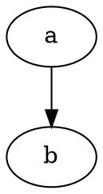

# Graphviz Attributes

Reference for Graphviz graph attributes that dotviz validates or handles
differently from the reference `dot` binary.

All behaviours have been verified against `dot` (Graphviz 14.0.0+).

---

## Table of Contents

1. [Overview](#1-overview)
2. [Graph-Level Attributes](#2-graph-level-attributes)
   - 2.1 [`_background`](#21-_background)
   - 2.2 [`charset`](#22-charset)
   - 2.3 [`layout`](#23-layout)
   - 2.4 [`layers`](#24-layers)
   - 2.5 [`linelength`](#25-linelength)

---

## 1. Overview

Graphviz defines hundreds of attributes for graphs, nodes, edges, and
clusters. Most pass through to the rendering backend unchanged. This
document covers only the attributes that receive explicit validation or
have a behavioural difference in dotviz.

---

## 2. Graph-Level Attributes

### 2.1 `_background`

**Type:** string (xdot format)  
**Applies to:** graph

An xdot-format drawing string rendered as a background layer behind the
graph. The xdot grammar encodes drawing operations (filled/unfilled
ellipses, polygons, bezier curves, polylines, text spans, pen/fill
colours, and gradients) as a compact text string. `dot` parses this
string and emits the corresponding shapes into the SVG output before
the graph nodes and edges.

Example:

```dot
graph {
  _background="c 7 -#ff0000 E 100 100 50 50"
}
```

**dotviz:** Not supported. Using `_background` is a fatal error.

**Rationale:** Supporting `_background` requires a full xdot renderer:
Graphviz's implementation spans `lib/xdot/xdot.c` (the xdot string parser,
`parseXDotF`) and a per-operation emit loop in `lib/common/emit.c`
(`emit_xdot`) that handles a dozen drawing operation kinds — ellipses,
polygons, bezier curves, polylines, text spans, flat colours, and linear
and radial gradients. The attribute is absent from the vast majority of
real-world DOT files, so carrying that complexity is not justified.
Silently ignoring it would produce incorrect output (missing background
shapes) with no indication to the user; failing with a clear error
surfaces the issue immediately.

---

### 2.2 `charset`

**Type:** string (IANA charset name)  
**Applies to:** graph

Controls the character encoding used for label text in the output.
`dot` accepts any IANA charset name — for example `latin1` encodes
labels as ISO-8859-1. The default is `UTF-8`.

**dotviz:** Only `utf-8` and `utf8` (case-insensitive) are accepted.
Any other value is a fatal error.

**Rationale:** Non-UTF-8 charsets are a legacy feature. dotviz renders
only UTF-8 output and cannot honour alternative encodings.

See `spec/DOT_LANGUAGE.md` §17 and §18.9 for character encoding context.

---

### 2.3 `layout`

**Type:** string (layout engine name)  
**Applies to:** graph

Selects the layout engine to use. Recognised values: `dot`, `neato`,
`fdp`, `sfdp`, `twopi`, `circo`. When the attribute is absent, `dot` is
used by default. On the command line, `-K<engine>` overrides the
attribute; the attribute in the graph is otherwise authoritative.

**dotviz:** The value must be one of the recognised engine names. An
unrecognised value or an HTML string value is a fatal error. Providing
both a `layout` attribute and an `engine` API option that disagree is
also a fatal error.

---

### 2.4 `layers`

**Type:** string (colon-separated layer names)  
**Applies to:** graph

Defines a named layer list. Nodes and edges can be assigned to one or
more layers via the `layer` attribute; `dot` renders only objects
belonging to the currently selected layers. The `layerselect` attribute
controls which layers are active.

Example:



**dotviz:** Supported in SVG output. When `dot` text output is also
requested, a warning is emitted because layer filtering cannot be
represented in the `dot` format.

---

### 2.5 `linelength`

**Type:** integer  
**Applies to:** graph

Sets the maximum line length (in characters) of the `dot` canonical
text output. A value of `0` means no limit. `dot` accepts any integer.

**dotviz:** The value must be `0` or an integer within the supported
range. Values outside the range or non-integer values are a fatal error.

**Rationale:** An out-of-range value would produce nonsensical output.
Stricter validation surfaces the mistake immediately rather than silently
capping or wrapping the value.

---
